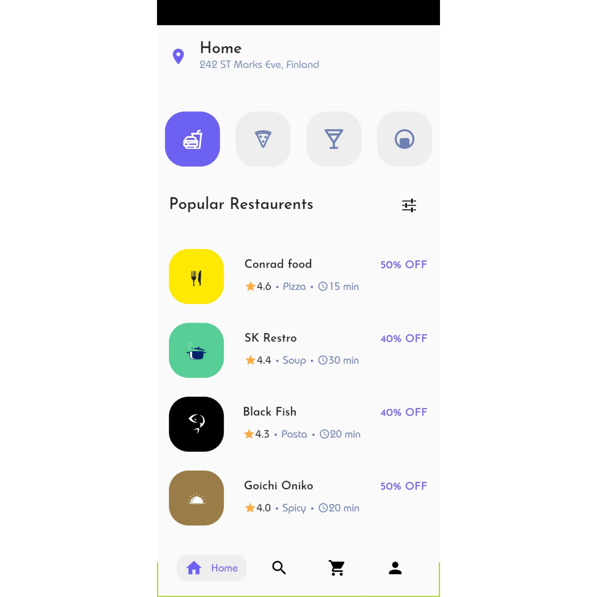
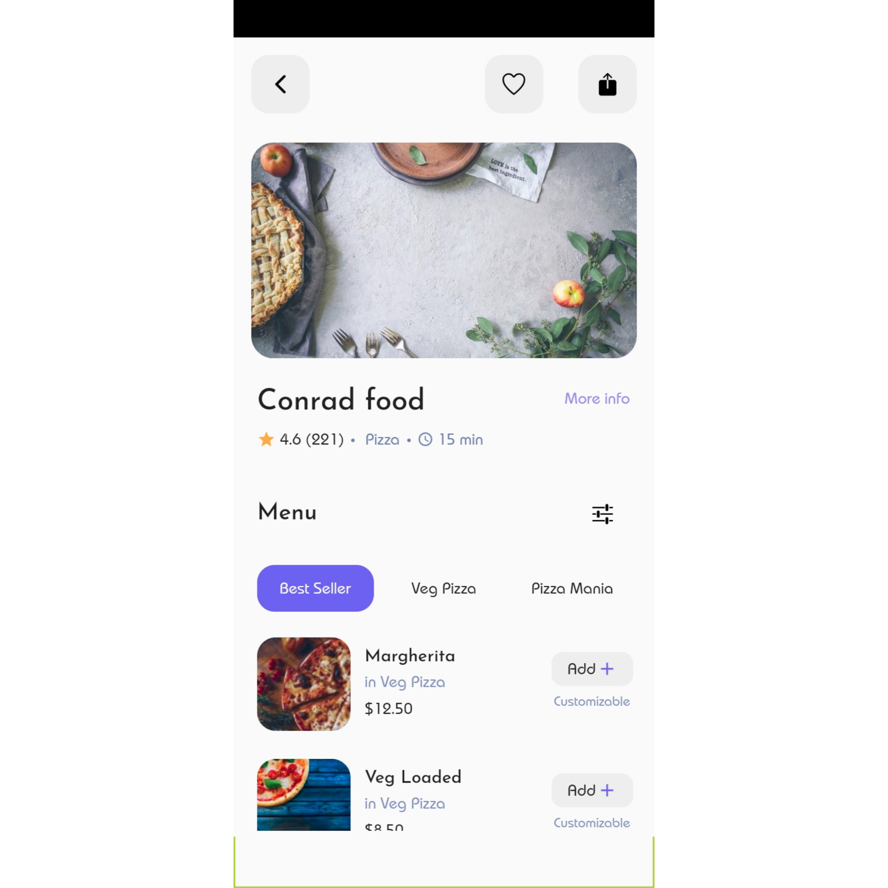
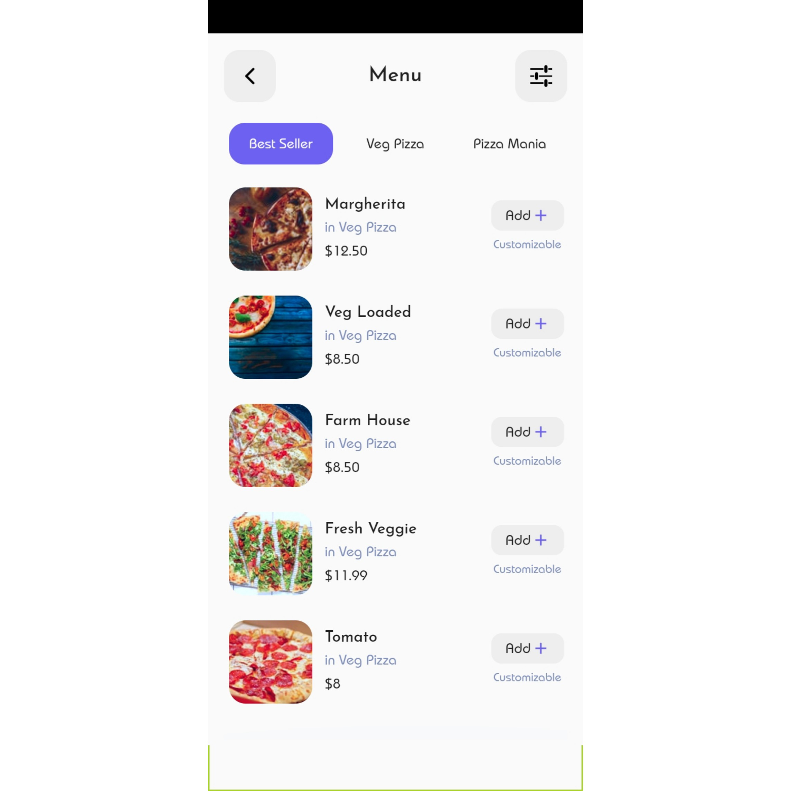

   

<!-- PROJECT LOGO -->
 

 
  <h1 align="center">Food Ordering App</h1>
  
This application shows a Food Ordering UI Concept.

<!-- TABLE OF CONTENTS -->

## Table of Contents

* [About the Project](#about-the-project)
  * [Built With](#built-with)
* [Contact](#contact)
* [Acknowledgements](#acknowledgements)

<!-- ABOUT THE PROJECT -->
## About The Project

## 

## 

## 

##

##

##

##

This application shows a Food Ordering UI Concept.

### Built With
* [Dart](https://dart.dev)
* [Flutter](https://flutter.dev)

<!-- GETTING STARTED -->

## Contact

Shashikant Dwivedi - [@theskd1999](https://twitter.com/theskd1999) - shashikant@shashikantdwivedi.com

Project Link: [https://github.com/shashikantdwivedi/Food_Ordering_App_By_Blackhole_Design](https://github.com/shashikantdwivedi/Food_Ordering_App_By_Blackhole_Design)

<!-- ACKNOWLEDGEMENTS -->
## Acknowledgements
* [flutter_icons](https://pub.dev/packages/flutter_icons)
* [Black Hole Design](https://dribbble.com/blackhole-design)
